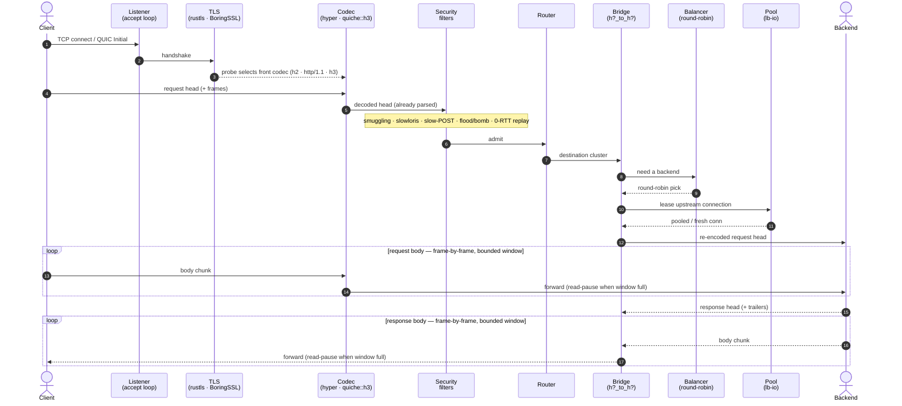

# Architecture Overview

This is the current, accurate developer-facing picture of how ExpressGateway
is put together: the crate layout, the two independent data planes, the L7
request path, the concurrency model, and the panic-free error posture. It is
written for an engineer reading the code or reviewing a change.

> **On `docs/architecture.md`.** That page is the canonical developer **crate
> map** — the 18 crates by layer plus a crate-dependency graph; go there for the
> crate-by-crate layout. *This* page is the architecture **narrative**: the two
> data planes, the request lifecycle, the concurrency model, and the panic-free
> posture.

## The one thing to understand first: parsing is delegated

ExpressGateway does **not** hand-roll its production wire parsers. The bytes on
the wire are decoded by mature, independently-fuzzed libraries:

| Wire | Library | Where |
|------|---------|-------|
| HTTP/1.1 | **hyper** | `crates/lb-l7/src/h1_proxy.rs` |
| HTTP/2 (+ HPACK) | **hyper / h2** | `crates/lb-l7/src/h2_proxy.rs` |
| HTTP/3 + QUIC (+ QPACK) | **quiche** (BoringSSL) | `crates/lb-quic/` |
| TLS (over TCP) | **rustls** (ring) | binary wiring + `TicketRotator` |
| WebSocket framing | **tungstenite** | `crates/lb-l7/src/ws_proxy.rs`, `crates/lb-quic/src/ws_tunnel.rs` |

The **only** hand-rolled parser on a production data path is
`lb_quic::public_header` (`crates/lb-quic/src/public_header.rs`) — the Mode A
QUIC public-header reader, which reads cleartext header fields **without
decrypting** anything. It is panic-free by construction and fuzzed
(see [`security-and-conformance.md`](security-and-conformance.md)).

**The `lb-h1` / `lb-h2` / `lb-h3-testcodec` crates are NOT live wire parsers.**
They are test codecs (used by the conformance/property harnesses) plus the
security-detector *types* (the smuggling / flood / bomb detectors that inspect
already-parsed headers). `lb-h3-testcodec` is a dev-/fuzz-dependency only — no
production crate links it (`Cargo.toml` members comment). Do not mistake their
existence for a second, hand-rolled HTTP stack; there isn't one.

## The 18 crates by logical layer

The workspace members are listed in the root [`Cargo.toml`](../../Cargo.toml)
(`[workspace].members`). Grouped by role:

**Binary**
- `lb` — the `expressgateway` binary (`crates/lb/src/main.rs`). Builds the
  Tokio runtime, loads + validates config, spawns the per-listener accept
  loops, installs the signal handlers and the panic hook.

**L7 (the userspace HTTP proxy)**
- `lb-l7` — the protocol-neutral bridge pipeline. All nine front×back bridges
  (`h1_to_h1.rs` … `h3_to_h3.rs`), the streaming H1 proxy (`h1_proxy.rs`), the
  H2 proxy (`h2_proxy.rs`), the WebSocket proxy (`ws_proxy.rs`), the gRPC proxy
  (`grpc_proxy.rs`), hop-by-hop stripping, trailers, and the `MAX_HEADERS` cap.
- `lb-grpc` — gRPC helpers: deadline parse + clamp, streaming-mode detection,
  status translation (framing only; the proxy lives in `lb-l7`).

**QUIC + HTTP/3 (real, quiche-backed)**
- `lb-quic` — the QUIC data plane on **quiche 0.29 / BoringSSL**. The
  per-connection H3 actor (`conn_actor.rs`), the H3↔{H1,H2,H3} relay
  (`h3_bridge.rs`), the Mode A no-decrypt public-header parser
  (`public_header.rs`) and router (`passthrough.rs`), the Mode B dual-connection
  relay (`raw_proxy.rs`), and the WS-over-H3 tunnel (`ws_tunnel.rs`). The crate
  carries `#![deny(indexing_slicing)]` **including its tests**.

**L4 (real XDP/eBPF)**
- `lb-l4-xdp` — a compiled XDP/eBPF data plane. The kernel program lives in
  `crates/lb-l4-xdp/ebpf/src/main.rs` and is compiled to the in-tree ELF
  `crates/lb-l4-xdp/src/lb_xdp.bin`; the aya userspace loader (`loader.rs`)
  attaches it. **Off by default** (`[runtime].xdp_enabled = false`). Validated
  live on Linux 7.0 native ENA `xdpdrv`.

**I/O + connection pools**
- `lb-io` — the I/O abstraction (`io_uring` with epoll fallback, live-probed by
  `detect_backend`), plus the upstream connection pools: `TcpPool` (H1/H2
  backends, `pool.rs`), `Http2Pool` (hyper h2 client, `http2_pool.rs`),
  `QuicUpstreamPool` (quiche client, `quic_pool.rs`), and the DNS resolver
  (`dns.rs`).

**Load balancing**
- `lb-balancer` — the backend-selection library. **Round-robin** is the live
  selection policy today (L7 HTTP via `RoundRobinUpstreams`, raw-TCP via
  `lb_balancer::RoundRobin`); QUIC Mode-A passthrough additionally uses **Maglev**
  hashing over the Connection ID (`passthrough.rs`). Ten further algorithms
  (weighted round-robin, P2C, ring-hash, EWMA, least-connections, least-request,
  random, weighted-random, session-affinity, and Maglev-for-L7) are implemented
  here — one file each under `crates/lb-balancer/src/` — but are **not yet
  selectable via configuration** (there is no policy key; the schema rejects
  unknown keys), and EWMA's latency input is fed only in tests. See
  [`../features.md`](../features.md) for the operator-facing load-balancing
  status.

**Configuration + control plane**
- `lb-config` — the TOML schema + validation (`#[serde(deny_unknown_fields)]`)
  and the SIGHUP reload diff (`reload.rs`: *swappable* vs *restart-required*,
  with an honesty contract — a restart-required change is logged, never
  silently applied).
- `lb-controlplane` — the `ConfigBackend` trait (`FileBackend` with atomic
  rename + an in-memory backend) and `ConfigManager` (validation + rollback).
- `lb-cp-client` — a thin remote-control-plane client (a full distributed
  control plane is deferred; see `audit/deferred.md`).

**Cross-cutting**
- `lb-security` — the DoS-detector catalog (slowloris/slow-POST timeouts,
  request-smuggling CL.TE/TE.CL/H2-downgrade, 0-RTT replay guard, retry-token
  signer, ticket rotator). Protocol-specific flood/bomb detectors live next to
  their codec (`lb-h2/src/security.rs`, `lb-h3-testcodec/src/security.rs`).
- `lb-health` — **passive** per-backend health-status tracking
  (consecutive-success/failure state, default 3 successes → Healthy, 2 failures
  → Unhealthy). In this build it is seeded but **not yet wired into backend
  selection** (the balancer does not consult it); **active probing**
  (interval/path/expected-status) is **deferred (REL-2-05)**.
- `lb-observability` — the metrics registry (`DashMap<String, AtomicU64>`),
  Prometheus exposition, and tracing init.
- `lb-core` — foundation types (`Backend`, `Cluster`, `LbPolicy`, `Shutdown`).

**Test infrastructure (not production parsers)**
- `lb-h1`, `lb-h2`, `lb-h3-testcodec` — test codecs + security-detector types
  (see the delegation note above).
- `lb-soak` — the external-process chaos/soak harness (binary `eg-soak`);
  permanent infrastructure that links no product crate.

## Two independent data planes (L4 + L7)

ExpressGateway is a hybrid L4 + L7 load balancer, and the two planes are
**independent**: enabling one does not require the other, and an operator can
run pure L7, pure L4, or both.

```
                    ┌───────────────────────────────────────────┐
   client traffic   │                                           │
   ───────────────► │   L4 XDP/eBPF  (in-kernel, off by default)│
                    │   conntrack-hit forward (XDP_TX)          │
                    │   + per-CPU new-flow (SYN-flood) rate cap │
                    └───────────────────────────────────────────┘
                            │ (XDP_PASS / not enabled)
                            ▼
                    ┌───────────────────────────────────────────┐
                    │   L7 userspace HTTP proxy (Tokio)         │
                    │   TLS → protocol probe → codec → filters  │
                    │   → router/policy → bridge → balancer     │
                    │   → upstream pump → downstream stream     │
                    └───────────────────────────────────────────┘
```

**L4 (XDP/eBPF).** The kernel program (`ebpf/src/main.rs`) parses the packet
with explicit bounds checks (any check failure ⇒ `XDP_PASS`, hand the packet
back to the kernel stack), looks up the flow in a conntrack LRU map, and on a
hit rewrites MAC + destination IP + ports and forwards in-kernel. New flows
(conntrack miss) are subject to a **per-CPU new-flow rate cap** — the Katran
`is_under_flood()` SYN-flood defense (`ROUND8-L4-03`). The per-VIP backend
table is Maglev-populated from userspace (`loader.rs`); note that *per-packet
Maglev backend selection in the kernel* is still a deferred slot (Pillar 4b-3,
`audit/deferred.md`) — today the in-kernel fast path is conntrack-hit
forwarding, and a miss falls through to userspace. See
[`../decisions/ADR-0004-ebpf-framework.md`](../decisions/ADR-0004-ebpf-framework.md),
[`../decisions/ADR-0005-bpf-map-schema.md`](../decisions/ADR-0005-bpf-map-schema.md),
and the toolchain split in
[`../decisions/ebpf-toolchain-separation.md`](../decisions/ebpf-toolchain-separation.md).

**L7 (userspace).** This is where HTTP termination, protocol translation, the
security filters, and load balancing happen. It runs entirely on Tokio and
never depends on XDP being loaded.

## The L7 request path

The sequence below is the whole path at a glance — a stylized single-connection
walk-through (one worker task, TLS listener). The request streams *down* the
participants and the response streams *back* frame-by-frame under a bounded
in-flight window. The numbered notes that follow zoom in on each stage.



*Life of a request on the L7 terminate path. Parsing is delegated to the codec;
everything above it (filters, routing, bridging, balancing, streaming) is this
project's own code. The bounded window is detailed in
[`backpressure.md`](backpressure.md).*

1. **Accept** — a per-listener accept loop accepts a TCP connection (H1/H2) or
   reads a QUIC datagram (H3).
2. **TLS** — for a TLS listener, a rustls handshake (`h1s`); QUIC's TLS is
   inside quiche/BoringSSL.
3. **Protocol probe** — ALPN (`h2`/`http/1.1`) or HTTP/1.1 prior-knowledge
   selects the front codec; `quic` listeners serve HTTP/3.
4. **Framing codec** — hyper (H1/H2) or quiche::h3 (H3) decodes the request.
5. **Security filters** — smuggling (CL.TE / TE.CL / H2-downgrade), slowloris
   (header timeout) + slow-POST (body timeout), flood/bomb detectors, QUIC
   0-RTT replay guard. See
   [`security-and-conformance.md`](security-and-conformance.md).
6. **Router / policy** — pick the destination cluster.
7. **Bridge** — `lb_l7::h{1,2,3}_to_h{1,2,3}` translates the request into the
   backend protocol (the protocol-neutral pipeline; see
   [`protocol-model.md`](protocol-model.md)).
8. **Balancer** — round-robin picks a backend (the live selection policy; see
   [`../features.md`](../features.md)); the upstream pool (`lb-io`) supplies a
   connection.
9. **Pump** — the request body is streamed upstream and the response body
   streamed back **frame-by-frame**, with no whole-body buffering. The bounded
   in-flight model is in [`backpressure.md`](backpressure.md).

## Concurrency model

- **Tokio multi-thread runtime, built by hand.** `main()` constructs the
  runtime with `tokio::runtime::Builder::new_multi_thread().enable_all()`
  rather than `#[tokio::main]` — the macro expands to an internal `.unwrap()`,
  and the project bans `unwrap` (`crates/lb/src/main.rs`, `fn main`).
- **One task per accept loop, one task per connection.** Each QUIC connection
  is owned by a single per-connection actor (`crates/lb-quic/src/conn_actor.rs`:
  "One tokio task per connection") that drives a `select!` loop over the socket,
  the H3 events, and the upstream channels.
- **Structured cancellation.** Shutdown propagates through
  `tokio_util::sync::CancellationToken`; SIGTERM flips `/readyz`, settles,
  cancels, then drains within a bounded budget (`drain_timeout_ms`, default
  10 s).
- **Hot config via `ArcSwap`.** Live config is held behind an `ArcSwap`
  snapshot per listener; a SIGHUP swaps the swappable subset in place
  (`lb-config/src/reload.rs`). No `std::sync::Mutex` sits on a hot path.

## Error / panic-free model

Panic-freedom is a structural invariant, not a convention:

- Every `crates/*/src/lib.rs` carries
  `#![deny(clippy::unwrap_used, clippy::expect_used, clippy::panic,
  clippy::indexing_slicing, clippy::todo, clippy::unimplemented,
  clippy::unreachable, missing_docs)]` (verified in, e.g.,
  `crates/lb-quic/src/lib.rs`). The `#[cfg(test)]` block re-allows the
  test-only lints; `lb-quic` keeps `indexing_slicing` denied **even in tests**.
- The release profile is `panic = "abort"` (root `Cargo.toml`,
  `[profile.release]`), so a panic cannot unwind across an `unsafe` block into a
  half-restored invariant.
- The binary installs a process-wide panic hook (`init_panic_hook` in
  `crates/lb/src/main.rs`) that logs via `tracing::error!`, bumps a
  `panic_total` counter, then aborts.
- CI enforces it (a panic-freedom job plus a halting-gate `awk` grep). See
  [`../decisions/ADR-0010-panic-free-enforcement.md`](../decisions/ADR-0010-panic-free-enforcement.md).

## Where to go next

- [`protocol-model.md`](protocol-model.md) — the 9-cell front×back matrix,
  HTTP/3, gRPC, and WebSockets.
- [`quic-modes.md`](quic-modes.md) — Mode A passthrough vs Mode B terminate,
  and the H3 connection lifecycle + recycling.
- [`backpressure.md`](backpressure.md) — the bounded-relay (R8) model.
- [`security-and-conformance.md`](security-and-conformance.md) — the delegation
  strategy, fuzzing, panic-freedom, and conformance posture.
- [`../features.md`](../features.md) and
  [`../known-limitations.md`](../known-limitations.md) — the operator-facing map
  of what is supported, gated, and waived.
- [`../decisions/`](../decisions/) — the ADRs (io_uring crate, H2 codec
  strategy, quiche integration, eBPF framework, BPF map schema, frame pipeline,
  compression crates, control-plane protocol, graceful reload, panic-free
  enforcement, and the quinn→quiche migration).
