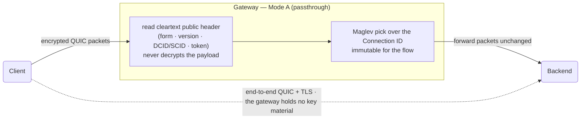
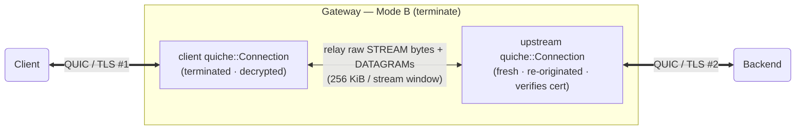

# QUIC Modes

ExpressGateway speaks QUIC three ways. This page is the deep dive: **Mode A
passthrough** (route by Connection ID, no decryption), **Mode B terminate**
(two distinct QUIC connections, raw relay), and the default **H3 terminate**
path with its connection-recycling lifecycle. All three live in `lb-quic`,
which runs on **quiche 0.29 / BoringSSL**. For the operator-facing trigger table
see [`../features.md`](../features.md#quic-modes).

| Mode | Config trigger | TLS state on the LB | What it relays |
|------|----------------|---------------------|----------------|
| **H3 terminate** (default) | `protocol = "quic"` | Full (terminates client QUIC, speaks `quiche::h3`) | HTTP/3 requests → H1/H2/H3 backend |
| **Mode A passthrough** | top-level `[passthrough]` | **None** (no decryption) | QUIC flows routed by CID to a backend |
| **Mode B terminate** | `[listeners.quic.raw_proxy]` | Two connections (client + upstream) | Raw STREAM bytes + DATAGRAMs |

## Mode A — passthrough (route by Connection ID, no decryption)

Source: `crates/lb-quic/src/passthrough.rs` (router) +
`crates/lb-quic/src/public_header.rs` (parser).

In Mode A the gateway holds **zero quiche/BoringSSL TLS state** — TLS stays
end-to-end between client and backend. It is a parallel datapath: a top-level
`[passthrough]` block, no `[[listeners]]` needed.



*Mode A: the gateway routes by Connection ID using only cleartext header bytes
and never decrypts; TLS stays end-to-end between client and backend.*

How a flow is routed:

1. **Parse the public header without decrypting.** `parse_public_header`
   (`public_header.rs`) reads only the cleartext public-header fields — form
   bit, version, DCID-len + DCID, SCID-len + SCID, the Initial token, and the
   length varint. It **never** touches encrypted payload, packet-number bytes,
   or header-protected reserved bits (the invariant is documented at the top of
   the file and is the basis of the no-decrypt property).
2. **Pick a backend by consistent hash.** A new flow's backend is chosen by
   **Maglev** over the live backend set (`lb_balancer::maglev::Maglev`) and is
   immutable for the flow's lifetime.
3. **Route by DCID identity.** Subsequent packets for the same client DCID go to
   the same backend. The routing-table value is `FlowEntry`, which carries the
   CID + routing only — **no key material** (enforced by an explicit field-audit
   destructuring in `passthrough.rs`).
4. **Stateless Retry as the Initial-flood defense.** With `mint_retry = true`
   (the default), a no-token Initial is answered with a hand-rolled stateless
   **Retry** token bound to the peer address (RFC 9000 §17.2.5 + RFC 9001 §5.8,
   `mint_retry`); only a Retry-completing (real, non-spoofed) source can open a
   flow.

Sizing:

- `max_quic_connections` default **100 000**; the routing-table-entry cap is
  **`2 × max`** (`passthrough.rs`, RFC 9000 §9.4 connection-migration headroom).
- The cap is a **global budget with no per-source-IP sub-cap** — a single real
  IP can consume it. Off-path spoofed sources cannot (they can't complete the
  Retry). This is a tunability gap, not an unbounded vector (audit `F-RES-3`,
  LOW; see
  [`../known-limitations.md`](../known-limitations.md#mode-a-passthrough-relies-on-the-quic-retry-round-trip)).

## Mode B — terminate (dual connections, raw relay)

Source: `crates/lb-quic/src/raw_proxy.rs`.



*Mode B: two distinct QUIC connections — the gateway terminates the client's TLS
and originates a fresh, certificate-verified upstream connection, relaying raw
streams and datagrams between them.*

In Mode B the gateway terminates the client QUIC connection **and** dials a
**fresh upstream QUIC connection** on a separate UDP socket with the same ALPN —
two distinct `quiche::Connection`s. It then relays between them at the QUIC
frame level (not HTTP):

- **STREAM relay.** An identity stream-id map; DATA bytes only. Each stream has
  a **bounded per-stream pending window** — `STREAM_RELAY_WINDOW = 256 KiB`
  (`raw_proxy.rs`). That window *is* the backpressure mechanism (see
  [`backpressure.md`](backpressure.md)): the relay stops reading a direction
  once its window is full, so quiche stops extending the peer's flow-control
  window.
- **DATAGRAM relay.** RFC 9221 unreliable datagrams are forwarded verbatim in
  both directions through two bounded queues (drop-newest when full).
- **Reset propagation.** A peer `RESET_STREAM` (surfaced as `stream_recv →
  Err(StreamReset(code))`) is relayed onward with the **same code**, and only
  the affected half is torn down; a peer `STOP_SENDING` is propagated likewise.
- **Sizing.** `max_relay_streams` default **256** (config
  `RawQuicProxyConfig::max_relay_streams`,
  `default_raw_proxy_max_relay_streams`); the datagram-queue cap default 1024.

Mode B **always verifies the upstream certificate** (it terminates and
re-originates real TLS).

## H3 terminate — the default path + connection recycling

Source: `crates/lb-quic/src/conn_actor.rs` (the per-connection actor) +
`crates/lb-quic/src/h3_bridge.rs` (the H3↔{H1,H2,H3} relay).

When a `quic` listener terminates HTTP/3, **one Tokio task per connection** owns
the whole connection from the Initial packet through close. The actor runs a
`select!` loop that drives the socket, the `quiche::h3` events, and the upstream
response channels (`conn_actor.rs`: "One tokio task per connection").

### Connection recycling (S36 — bounds per-connection state growth)

Long-lived H3 connections that serve a high volume of requests accumulate
per-connection state inside quiche (the `collected` set — the `CF-GRPC-H3-CHURN-RSS`
issue). The fix is a request cap that recycles the connection:

```
requests_served reaches max_requests_per_h3_connection (config, default 1000)
        │
        ▼
goaway_pending = true   ── stop admitting NEW request streams immediately
        │
        ▼
send H3 GOAWAY for goaway_last_id   (H3_NO_ERROR = 0x0100; graceful drain,
        │                            RFC 9114 §5.2). Retried on a StreamBlocked
        │                            control-stream window until it lands.
        ▼
goaway_sent = true      ── streams opened past the GOAWAY last-stream-id are
        │                  reset with H3_REQUEST_REJECTED (0x010b); a client MAY
        │                  retry those on a fresh connection (RFC 9114 §5.2)
        ▼
drain in-flight, then close   ── quiche frees the per-connection state; the
                                client reopens a fresh connection
```

Setting `max_requests_per_h3_connection = 0` disables the whole mechanism — the
H3 front is then byte-identical to the pre-S36 behavior (the `cap == 0`
short-circuit, an explicit R3 invariant in `conn_actor.rs`). The actor bumps
`goaway_sent_total` when it sends the cap GOAWAY.

### H3 stream shutdown codes

The actor uses the RFC 9114 §8.1 / RFC 9204 §8.3 error codes
(`conn_actor.rs`):

| Code | Constant | Meaning / when |
|------|----------|----------------|
| `0x0100` | `H3_NO_ERROR` | Graceful drain (the recycling GOAWAY). |
| `0x010b` | `H3_REQUEST_REJECTED` | Stream opened past the GOAWAY last-id — client may retry on a fresh connection. |
| `0x0102` | `H3_INTERNAL_ERROR` | Internal failure (deliberately *not* `H3_NO_ERROR`). |
| `0x010e` | `H3_MESSAGE_ERROR` | Malformed request/response (e.g. bad pseudo-headers). |
| `0x0105` | `H3_FRAME_UNEXPECTED` | A frame arrived in a context where it is not allowed. |
| `0x0200` | `QPACK_DECOMPRESSION_FAILED` | The decoder could not interpret an encoded field section. |

## See also

- [`backpressure.md`](backpressure.md) — the bounded-relay model the
  `STREAM_RELAY_WINDOW` and the H3 body channel implement.
- [`protocol-model.md`](protocol-model.md) — the H3 stack and the 9-cell matrix.
- [`../features.md`](../features.md#quic-modes) — the operator trigger table.
- [`../decisions/ADR-0003-quiche-integration.md`](../decisions/ADR-0003-quiche-integration.md)
  and
  [`../decisions/quinn-to-quiche-migration.md`](../decisions/quinn-to-quiche-migration.md).
