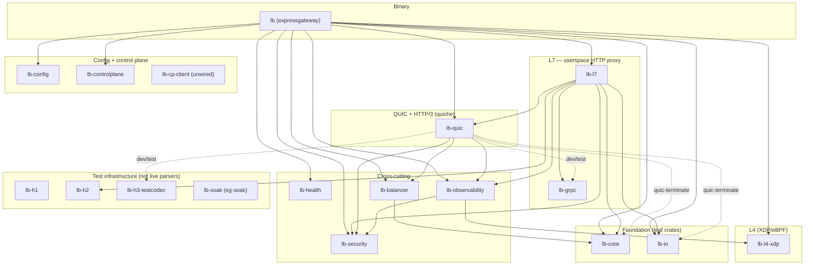

# ExpressGateway — Crate Map (developer reference)

This is the canonical map of the workspace: what each of the **18 crates**
does, where its key code lives, and how the crates depend on one another. It is
written for an engineer reading the code or reviewing a change.

This page is the *map*. For the running picture it complements:

- [`arch/overview.md`](arch/overview.md) — the request-path narrative, the two
  data planes, the concurrency and panic-free models, and the **"parsing is
  delegated"** model (the canonical home for that fact).
- [`arch/extending.md`](arch/extending.md) — the dev loop and worked "how to make
  a change" guides (bridge cells, backend protocols, the load-balancer-policy
  seam) plus the audit-trail map.
- [`features.md`](features.md) / [`known-limitations.md`](known-limitations.md) —
  what is supported, gated, partial, and deferred.
- [`decisions/`](decisions/) — the ADRs (why the shape is what it is).

One sentence of orientation before the map: ExpressGateway does **not** hand-roll
its production wire parsers — H1/H2 are hyper/h2, H3+QUIC are quiche/BoringSSL,
TLS is rustls, WebSocket framing is tungstenite; the only hand-rolled parser on a
live data path is `lb_quic::public_header` (the Mode A no-decrypt header reader).
The full delegation model is in [`arch/overview.md`](arch/overview.md).

## The 18 crates by layer

The workspace members are listed in the root [`Cargo.toml`](../Cargo.toml)
(`[workspace].members`). Grouped by role:

### Binary
- **`lb`** — the `expressgateway` binary (`crates/lb/src/main.rs`). The
  **composition root**: it builds the Tokio runtime by hand (no `#[tokio::main]`,
  which would expand to an `.unwrap()`), loads + validates the config, builds a
  `ListenerState` per listener, spawns the per-listener accept loops, wires every
  live crate together, and installs the signal handlers and the panic hook.

### L7 — the userspace HTTP proxy
- **`lb-l7`** — the protocol-neutral bridge pipeline and the streaming proxies.
  The nine front×back bridge cells (`h1_to_h1.rs` … `h3_to_h3.rs`), the `Bridge`
  trait + neutral `BridgeRequest`/`BridgeResponse` + `create_bridge` factory
  (`lib.rs`), the streaming H1 proxy (`h1_proxy.rs`) and H2 proxy (`h2_proxy.rs`)
  over hyper, the WebSocket proxy (`ws_proxy.rs`), the gRPC proxy
  (`grpc_proxy.rs`), the round-robin picker + backend-protocol type
  (`upstream.rs`), hop-by-hop stripping (`stripped_request.rs`), and the
  `MAX_HEADERS = 256` cap enforced on every bridge.
- **`lb-grpc`** — gRPC helpers (framing only; the proxy lives in `lb-l7`):
  `grpc-timeout` deadline parse + 300 s clamp, streaming-mode detection, and
  HTTP↔gRPC status translation.

### QUIC + HTTP/3 (real, quiche-backed)
- **`lb-quic`** — the QUIC data plane on **quiche 0.29 / BoringSSL**. The
  per-connection H3 actor (`conn_actor.rs`), the H3↔{H1,H2,H3} relay
  (`h3_bridge.rs`), the Mode A no-decrypt public-header parser
  (`public_header.rs`, the only hand-rolled parser on a live path) and its
  route-by-CID router (`passthrough.rs`, Maglev over the Connection ID), the
  Mode B dual-connection terminate-and-re-originate relay (`raw_proxy.rs`), and
  the WS-over-H3 tunnel (`ws_tunnel.rs`). The crate carries
  `#![deny(indexing_slicing)]` **including its tests**.

### L4 (real XDP/eBPF)
- **`lb-l4-xdp`** — a compiled XDP/eBPF data plane. The kernel program lives in
  `crates/lb-l4-xdp/ebpf/src/main.rs`, is compiled to the in-tree ELF
  `crates/lb-l4-xdp/src/lb_xdp.bin`, and the aya userspace loader (`loader.rs`)
  attaches it. **Off by default** (`[runtime].xdp_enabled = false`). It is a real
  compiled BPF program (validated live on Linux 7.0 native ENA `xdpdrv`), not a
  model.

### I/O + connection pools
- **`lb-io`** — the I/O abstraction (`io_uring` with an epoll fallback,
  live-probed by `detect_backend`) and the upstream connection pools: `TcpPool`
  (H1/H2 backends, `pool.rs`), `Http2Pool` (hyper h2 client, `http2_pool.rs`),
  `QuicUpstreamPool` (quiche client, `quic_pool.rs`), the DNS resolver
  (`dns.rs`), and socket-option helpers (`sockopts.rs`).

### Load balancing
- **`lb-balancer`** — eleven backend-selection algorithms, one file each under
  `crates/lb-balancer/src/` (`round_robin`, `weighted_round_robin`, `random`,
  `weighted_random`, `least_connections`, `least_request`, `p2c`, `maglev`,
  `ring_hash`, `ewma`, `session_affinity`). Round-robin is the live selection
  policy for L7 HTTP and raw-TCP listeners; QUIC Mode A passthrough additionally
  uses Maglev hashing over the Connection ID (that picker lives in `lb-quic`).
  The other algorithms are implemented but **not yet selectable via
  configuration** (there is no policy key). See [`features.md`](features.md) for
  the reachability detail.

### Configuration + control plane
- **`lb-config`** — the typed TOML schema + validation
  (`#[serde(deny_unknown_fields)]`, `lib.rs`) and the SIGHUP reload diff
  (`reload.rs`: *swappable* vs *restart-required*, with a restart-required change
  logged rather than silently applied).
- **`lb-controlplane`** — the `ConfigBackend` trait (`FileBackend` with
  atomic-rename writes + an in-memory backend) and `ConfigManager`
  (validate-then-swap with a rollback slot). This is the config manager the
  binary uses.
- **`lb-cp-client`** — a thin remote-control-plane client. It is **not linked by
  the binary** in this build (the binary uses only `lb-controlplane`'s
  `ConfigManager`/`FileBackend`); a full distributed control plane is deferred.

### Cross-cutting
- **`lb-security`** — the DoS-detector catalog (slowloris / slow-POST timeouts,
  request-smuggling CL.TE / TE.CL / H2-downgrade, the 0-RTT replay guard), the
  retry-token signer, and the TLS ticket rotator. Protocol-specific flood/bomb
  detectors live next to their codec (`lb-h2/src/security.rs`,
  `lb-h3-testcodec`).
- **`lb-health`** — a **passive** per-backend health-status state machine
  (`HealthStatus` + consecutive success/failure thresholds). In this build it is
  **not yet wired into backend selection** (the balancer does not consult it),
  and **active probing is deferred**. See [`features.md`](features.md) and
  [`known-limitations.md`](known-limitations.md).
- **`lb-observability`** — the lock-free metrics registry
  (`DashMap<String, AtomicU64>`), Prometheus exposition, and tracing init
  (`LB_LOG_FORMAT`). It also owns the metric *types* for `lb-l4-xdp` and
  `lb-security` (a one-directional dependency edge — see the graph).
- **`lb-core`** — foundation types: `Backend`, `Cluster`, `LbPolicy`
  (`policy.rs`), `Shutdown`, and the shared authority validator
  (`authority::validate`, hoisted here so `lb-l7` and `lb-quic` share one
  implementation without a cycle). A true leaf crate (zero `lb-*` dependencies).

### Test infrastructure (not live wire parsers)
- **`lb-h1`**, **`lb-h2`**, **`lb-h3-testcodec`** — test codecs (used by the
  conformance / property harnesses) plus the security-detector *types* that
  inspect already-parsed headers. They are **not** the live wire parsers (see the
  delegation note in [`arch/overview.md`](arch/overview.md)). `lb-l7` links
  `lb-h2` in production, but only for its HPACK-token tables and its
  flood/bomb detector types — the HTTP/2 wire is parsed by hyper/h2. `lb-h1` and
  `lb-h3-testcodec` are dev-/fuzz-dependencies; no production crate links them.
- **`lb-soak`** — the external-process chaos/soak harness (binary `eg-soak`).
  Permanent infrastructure that links **no** product crate.

## Crate dependency graph



*Crate dependency graph. Solid edges are production `[dependencies]`; dotted edges
are feature-gated or dev/test-only. `lb` is the composition root that links every
live crate. `lb-l7 → lb-h2` links only lb-h2's HPACK-token tables and flood/bomb
detector types — the HTTP/2 wire is parsed by hyper/h2, not lb-h2. `lb-quic`'s
edges to `lb-core`/`lb-io` are enabled by the default `quic-terminate` feature (a
`quic-passthrough-only` build drops them). `lb-cp-client`, `lb-h1`, and `lb-soak`
are not linked by any production crate; `lb-h1` and `lb-h3-testcodec` are linked
only by the integration-test and fuzz harnesses.*

Reading the graph, three structural choices are worth knowing:

- **The binary is the only place everything meets.** `lb` wires the live crates
  together; the libraries do not reach "up" into it. A change to a library is
  composed in `main.rs`, which is where you wire a new knob, picker, or pool.
- **`lb-core` and `lb-io` are leaves.** Foundation types live in `lb-core` (it has
  zero `lb-*` dependencies) so both `lb-l7` and `lb-quic` can share them without a
  cycle — that is why the authority validator was hoisted into `lb-core` rather
  than living in `lb-l7`. Touching a leaf rebuilds a lot; touching the binary
  rebuilds only itself.
- **`lb-l7 → lb-quic` is the one cross-layer edge.** The L7 proxy depends on the
  QUIC crate (not the reverse) so the H1→H3 / H2→H3 upstream paths can reach the
  quiche client. The reverse edge is deliberately avoided to keep the graph
  acyclic.

## Counts, line totals, and test totals

This page deliberately does **not** bake in dated LOC / test-count snapshots
(the previous revision's numbers drifted and contradicted the rest of the doc).
Read them live from the source of truth instead:

```bash
# Crate list and dependency edges (the graph above, authoritative):
cargo tree -e normal --workspace

# Per-crate / per-language line counts:
tokei crates    # or: scc crates

# The full test inventory and pass/fail:
cargo test --workspace --all-features --no-fail-fast
```

The closed lists that the release gate checks — the required artifacts and the
required test names — live in [`../manifest/`](../manifest/)
(`required-artifacts.txt`, `required-tests.txt`) and are hashed into
`.halting-gate.sha256`, so they cannot drift silently.

## History and design decisions

The "why" behind this shape is recorded, not lost:

- **ADRs** — [`decisions/`](decisions/): ADR-0001…0010 plus
  `ebpf-toolchain-separation.md` and `quinn-to-quiche-migration.md` (the io_uring
  crate choice, the H2 codec strategy, quiche integration, the eBPF framework and
  BPF map schema, the frame pipeline, the compression decision, the control-plane
  protocol, graceful reload, and panic-free enforcement).
- **Deferred work** — [`../audit/deferred.md`](../audit/deferred.md): the honest
  list of partial and deferred features (for example, in-kernel per-packet Maglev
  backend selection (ROUND8-L4-04) and the Wave-2c protocol-wiring follow-ons).
  The load-balancing and health reality is in [`features.md`](features.md) and
  [`known-limitations.md`](known-limitations.md).
- **The evidence trail** — [`../audit/`](../audit/): session reports, security
  (S38), perf/soak/reliability data, and the executive
  [`../audit/FINAL_REPORT.md`](../audit/FINAL_REPORT.md). The audit-trail map for
  contributors is in [`arch/extending.md`](arch/extending.md).
