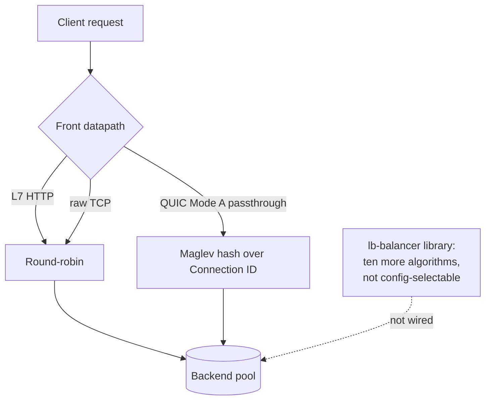

# Features & Protocol Support

This document is the operator-facing map of **what ExpressGateway
supports, what is gated off by default, and what is waived**. It reflects
the audited state of the current build (security posture in
[`../SECURITY.md`](../SECURITY.md)). For the byte-level schema see
[`guide/CONFIG.md`](guide/CONFIG.md); for the bounded constraints behind
each "gated"/"waived" cell, and a "who does this affect?" note on each,
see [`known-limitations.md`](known-limitations.md). Unfamiliar term?
[`glossary.md`](glossary.md) defines the jargon.

## Protocol matrix (front × back)

The gateway proxies the full **9-cell** matrix: any of HTTP/1.1, HTTP/2,
HTTP/3 on the client-facing (front) side, translated to any of HTTP/1.1,
HTTP/2, HTTP/3 on the backend side. Header/trailer translation funnels
through hyper's typed `HeaderName`/`HeaderValue` (H1/H2 wire) or QPACK
(H3 wire), so CRLF/NUL cannot split a field on egress.

| front ↓ \ back → | **H1** | **H2** | **H3** |
|------------------|--------|--------|--------|
| **H1** (`h1`, `h1s`) | ✅ | ✅ | ✅ |
| **H2** (`h1s` ALPN) | ✅ | ✅ | ✅ |
| **H3** (`quic`)      | ✅ | ✅ | ✅ |

Front protocol is chosen by the **listener** `protocol`: `h1`/`h1s` serve
H1 (and H2 via ALPN on `h1s`); `quic` serves H3. Back protocol is the
per-backend `protocol` (`tcp`/`h1` → HTTP/1.1, `h2` → HTTP/2, `h3` →
HTTP/3). Responses are streamed frame-by-frame; the gateway never buffers
a whole request or response body (bounded by 64 MiB caps + 413/erroring).
How each cell translates is covered in
[`arch/protocol-model.md`](arch/protocol-model.md).

## QUIC modes

| Mode | Trigger | Behaviour |
|------|---------|-----------|
| **H3 terminate** (default) | `protocol = "quic"` | Gateway terminates the client QUIC connection and speaks HTTP/3 (`quiche::h3`), then proxies to an H1/H2/H3 backend. |
| **Mode A passthrough** | top-level `[passthrough]` | Routes QUIC flows to backends **by Connection ID without decrypting** — TLS stays end-to-end client↔backend; the gateway holds no TLS state. A parallel datapath (no `[[listeners]]` needed). |
| **Mode B terminate** | `[listeners.quic.raw_proxy]` | Gateway terminates the client QUIC and **re-originates a fresh upstream QUIC** connection, relaying raw streams + datagrams between two distinct `quiche::Connection`s. |

The trade-offs between these three are explained in
[`arch/quic-modes.md`](arch/quic-modes.md).

## Application protocols

| Feature | Status | Notes |
|---------|--------|-------|
| **HTTP/1.1, HTTP/2, HTTP/3** | ✅ Supported | H2 served on `h1s` via ALPN (no separate `h2` listener); H3 served on `quic`. |
| **gRPC** | ✅ Supported (H2/H3 front) | Needs an **H2 or H3 front and an `h2`/`h3` backend**. An H1 front cannot deliver `grpc-status` trailers on a streamed response (matches nginx — see [known-limitations](known-limitations.md)). Deadline clamp + synthesized health check via `[listeners.grpc]`. |
| **WebSocket over H1** | ✅ Supported (default-on) | RFC 6455 `Upgrade`. On by default once `[listeners.websocket]` is present. |
| **WebSocket over H2** | ⛔ **Gated OFF by default** | RFC 8441 extended-CONNECT. Opt-in via `websocket.h2_extended_connect = true`. Off because an H2 WS stream can buffer unbounded against a stalled peer (a hyper backpressure limitation). See [known-limitations](known-limitations.md). |
| **WebSocket over H3** | ☑️ Opt-in | RFC 9220 extended-CONNECT. Enable via `websocket.h3_extended_connect = true`. |

## Load balancing

This is the canonical description of how ExpressGateway picks a backend
and what health tracking it performs. Other pages link here rather than
restate it.

### What picks a backend today

| Listener / datapath | Backend selection |
|---------------------|-------------------|
| **L7 HTTP** listeners (`h1` / `h1s`) | **Round-robin** across the backend pool. |
| **Raw-TCP** listeners | **Round-robin** across the backend pool. |
| **QUIC Mode A passthrough** | **Maglev** consistent-hashing over the QUIC **Connection ID** — the same client flow keeps landing on the same backend without decrypting. |
| **QUIC H3-terminate** (default `quic`) | **First backend only** — not load-balanced across multiple backends. |
| **QUIC Mode B terminate** (`raw_proxy`) | **Single backend** — re-originates to the one configured `raw_proxy.backend_addr`. |

*Round-robin selects backends for L7 (HTTP) and raw-TCP listeners; QUIC
Mode A passthrough hashes the Connection ID with Maglev. The rest of the
algorithm library is implemented but not yet wired to a selection knob.*

The QUIC **terminate** modes accept extra backend entries but do not
load-balance them: H3-terminate always picks the first backend
(`select_backend` returns `backends.first()`, `crates/lb-quic/src/conn_actor.rs:1682`;
H2/H3 backend legs are wired with a single address), and Mode B
re-originates to its one `raw_proxy.backend_addr`.

### The algorithm library (implemented, not yet selectable)

Eleven backend-selection algorithms are implemented and unit-tested in
the `lb-balancer` library: round-robin, weighted round-robin, random,
weighted-random, least-connections, least-request, power-of-two-choices
(P2C), Maglev, ring-hash, EWMA, and session-affinity.

In **this build** only the live policies above are reachable. The
remaining algorithms — weighted round-robin, P2C, ring-hash, EWMA,
least-connections, least-request, random, weighted-random,
session-affinity, and Maglev applied as a general L7 policy — are **not
yet selectable via configuration**: there is no policy key, and the
config schema rejects unknown keys (`deny_unknown_fields`), so an
operator cannot add one. EWMA's per-request latency input is fed only in
tests, so even if it were selectable it would currently degrade to a
load-based pick.

> Practical effect: do not plan a deployment around choosing a
> non-default algorithm (sticky sessions, least-connections, P2C, etc.)
> in this build — round-robin and Maglev-by-Connection-ID are the only
> selections that take effect.

### Backend `weight`

The per-backend `weight` field is **accepted but not yet enforced**:
round-robin and Maglev-by-Connection-ID ignore it, and the
weighted algorithms that would consume it are not selectable. Setting
`weight` parses and validates but does not change traffic distribution in
this build. See [`guide/CONFIG.md`](guide/CONFIG.md).

### Health tracking

ExpressGateway implements **passive** per-backend health tracking — a
consecutive-success / consecutive-failure state machine (`HealthChecker`,
rise/fall thresholds). In this build it is **not yet wired into live
backend selection**: the checkers are seeded at startup but the balancer
does not consult them, and nothing in the live request path feeds them.
**Active probing** (interval / path / expected-status) is **deferred
(REL-2-05)** — it is not implemented. The operator impact is covered in
[`known-limitations.md`](known-limitations.md).

## TLS

| Aspect | State |
|--------|-------|
| Stack | rustls + BoringSSL (via quiche for QUIC). |
| Versions | TLS 1.2 + 1.3 by default (downgrade-safe: ECDHE-only, AEAD-only; no SSLv3/TLS1.0/1.1, no RC4/CBC-without-EtM). `tls13_only = true` restricts to 1.3 for PCI-DSS-style requirements. |
| Client (mTLS) | **No server-side mTLS** — the gateway does not request a client cert (`with_no_client_auth()`). Intentional for an internet-facing reverse proxy. |
| Upstream verification | **Enforced.** H3 backends verify the upstream cert by default (`tls_verify_peer`, requires `tls_ca_path`); Mode B always verifies. |
| Session tickets | Rotated daily with an overlap window (`TicketRotator`). |

## Conformance

| Suite | Result | Source of truth |
|-------|--------|-----------------|
| **h2spec** (HTTP/2) | **147/147 pass** | `tests/h2spec.rs` + `guide/DEPLOYMENT.md`. |
| **h3spec** (HTTP/3 + QUIC) | Passes with **12 named waivers** | `scripts/ci/h3spec-check.sh` (`CF-QUICHE-UPGRADE`). The waivers are quiche-0.29 transport deviations + QPACK uni-stream items that quiche reads-and-discards (inert, no amplification); a new failure outside the waiver list fails CI. See [known-limitations](known-limitations.md). |

## Operational features

- **SIGHUP config hot reload** — the swappable subset (backends, HTTP
  timeouts) is applied live; restart-required changes are logged rather
  than silently applied; an invalid config is rolled back atomically.
  ([`guide/CONFIG.md`](guide/CONFIG.md))
- **SIGUSR1 TLS cert rotation** — atomic `TlsConfigBundle` swap under
  in-flight handshakes.
- **Graceful drain on SIGTERM** — lameduck `/readyz` flip → settle →
  cancel → bounded drain budget (`drain_timeout_ms`, default 10 s).
- **Admin API** — `/metrics` (token-gated), probes `/livez /readyz
  /startupz /healthz`; loopback-only by default.
  ([`guide/METRICS.md`](guide/METRICS.md))
- **L4 XDP/eBPF** data plane — single-kernel; bounds-checked packet parse +
  per-CPU new-flow rate cap; validated live on Linux 7.0. Off by default
  (`xdp_enabled`). ([`guide/DEPLOYMENT.md`](guide/DEPLOYMENT.md))

## Security defenses (summary)

The gateway ships a DoS-mitigation catalog enforced on live listeners:
Rapid-Reset (CVE-2023-44487), CONTINUATION flood (CVE-2024-27316), HPACK /
QPACK bomb, SETTINGS / PING flood, zero-window stall, slowloris (header) +
slow-POST (body) timeouts, request smuggling (CL.TE / TE.CL / H2
downgrade), QUIC 0-RTT replay, and the HTTP/3 connection-recycling cap.
The full mapping and the security-audit verdict are in
[`../SECURITY.md`](../SECURITY.md).
</content>
</invoke>
