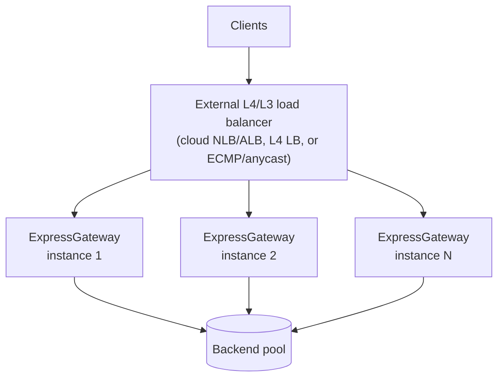

# Deployment Patterns

How to run ExpressGateway for availability and scale. This page is the
canonical home for **topology** — how many instances, how they sit behind
other infrastructure, and how they fail over. For the single-host
mechanics (the systemd unit, Linux capabilities, sysctls, the kernel
floor, the XDP toolchain) see [`DEPLOYMENT.md`](DEPLOYMENT.md); for the
config schema see [`CONFIG.md`](CONFIG.md).

## The model: one stateless instance

ExpressGateway is **stateless**. An instance holds only in-flight
connection state — TCP/TLS sessions, QUIC flows, the per-connection proxy
machinery, the TLS session-ticket key, and an in-memory DNS cache. None of
that is shared with, or recoverable from, another instance. There is no
cluster membership, no leader election, no replicated routing table, no
shared session store.

That single fact drives every pattern below: because an instance shares
nothing, you scale and you fail over the same way — **by running more
independent instances and putting a load balancer in front of them.** Each
instance is interchangeable; losing one costs you only its in-flight
connections, which the client (or the fronting LB) retries elsewhere.

### What "HA" means here, plainly

There is **no built-in clustering, failover, or state sharing** — and no
VRRP, no virtual-IP arbitration, no gossip. High availability is achieved
*around* ExpressGateway, by the same L3/L4 layer you already use to make
any stateless service redundant:

- Run **N instances** (N ≥ 2 for redundancy).
- Front them with an **external L4/L3 load balancer** — a cloud NLB/ALB,
  another L4 balancer, or ECMP / anycast routing.
- The fronting layer health-checks each instance (see
  [Health probes](#health-probes-for-the-fronting-layer)) and stops
  sending traffic to one that fails.

The configuration is **file-backed**: each instance reads its own TOML and
re-reads it on `SIGHUP` (see [`CONFIG.md`](CONFIG.md) "Reload semantics").
A pluggable control-plane backend for distributed or dynamically-pushed
config is a future seam in the codebase (`HaPoller`) but is **not wired
into the shipped binary** — today every instance is configured from its
own file, so a config change is rolled out the way any file-backed service
rolls one out (config-management tool writes the file, then `SIGHUP`).

## Pattern 1 — single node

The simplest deployment: one `expressgateway` process under a process
supervisor. Use it for development, staging, or a single-tenant edge where
the host itself is the unit of redundancy (e.g. an autoscaling group that
replaces a failed VM).

Run it under systemd exactly as [`DEPLOYMENT.md`](DEPLOYMENT.md) "systemd
unit" describes — that file owns the unit, the capability set, the rlimits,
and the sysctls, and is the single source of truth for them. The supervisor
gives you automatic restart on crash (`Restart=on-failure`) and a clean
`SIGTERM` graceful drain on stop.

A single node has a single point of failure (the host). For anything
production-facing, move to Pattern 2.

## Pattern 2 — horizontal scale-out behind an external LB

The production shape. Run N instances — on separate hosts, VMs, or
availability zones — behind one external L4/L3 load balancer. Because each
instance is stateless and interchangeable, this scales throughput linearly
and removes the single-host failure mode.



*N stateless ExpressGateway instances behind one external L4/L3 load
balancer; each instance proxies to the shared backend pool.*

Design notes:

- **The fronting LB owns failover.** It health-checks each instance and
  removes a failed one from rotation. ExpressGateway does not coordinate
  with its peers — give the fronting layer a real health check (next
  section), not just a TCP-connect test, so a wedged-but-listening
  instance is taken out.
- **Pick the fronting LB by protocol.** An L4 (TCP/UDP) balancer preserves
  end-to-end TLS to the gateway and is required for QUIC/HTTP/3 (UDP) and
  for [Mode A passthrough](../arch/quic-modes.md). An L7 balancer in front
  is usually redundant with what ExpressGateway already does and adds a
  hop — prefer L4.
- **Keep instances configured identically.** Roll a config change to every
  instance's file, then `SIGHUP` each (a config-management tool, or a
  rolling restart). Drain jitter spreads close events across the fleet so
  a simultaneous reload/restart doesn't produce a reconnect storm — see
  [`RUNBOOK.md`](RUNBOOK.md) "Drain jitter".

### Side-by-side process handover (`SO_REUSEPORT`)

On a single host you can hand traffic from an old process to a new one
without a listen-socket gap. ExpressGateway sets **`SO_REUSEPORT`** on its
listening sockets, so a supervisor can start a replacement process bound to
the *same* address while the old one is still draining: the kernel
load-balances new connections across both sockets, the old process finishes
its in-flight work on `SIGTERM` and exits, and the new one takes over.

This is a **manual, supervisor-driven** handover. The binary does not pass
listening sockets between processes — the two processes simply both bind
the port via `SO_REUSEPORT`. The operator-driven restart procedure (flip
`/readyz`, settle, drain, then swap) lives in [`RUNBOOK.md`](RUNBOOK.md)
"Drain (graceful shutdown)".

## Pattern 3 — Kubernetes

A Deployment of N replicas is the Kubernetes expression of Pattern 2: the
Service (or an external LB / Ingress) is the fronting balancer, and each Pod
is one stateless instance.

The image is built from `docker/Dockerfile` (distroless, non-root uid
65532). It takes the config path as a **positional argument** — there is no
`--config` flag — so pass the path as a container `arg`. Mount the TOML from
a ConfigMap.

```yaml
apiVersion: apps/v1
kind: Deployment
metadata:
  name: expressgateway
spec:
  replicas: 3
  selector:
    matchLabels: { app: expressgateway }
  template:
    metadata:
      labels: { app: expressgateway }
    spec:
      # >= readiness_settle_ms + drain_timeout_ms + the 2 s QUIC budget.
      # With the defaults that is 11 + 10 + 2 = 23 s; 30 leaves headroom.
      # See RUNBOOK.md "Tuning readiness_settle_ms".
      terminationGracePeriodSeconds: 30
      securityContext:
        runAsNonRoot: true
      containers:
        - name: expressgateway
          image: expressgateway:<tag>
          args: ["/etc/expressgateway/config.toml"]   # positional; NOT --config
          ports:
            - { name: https,      containerPort: 443,  protocol: TCP }
            - { name: https-quic, containerPort: 443,  protocol: UDP }  # HTTP/3
            - { name: admin,      containerPort: 9090, protocol: TCP }
          startupProbe:                  # gate liveness until boot completes
            httpGet: { path: /startupz, port: admin }
            periodSeconds: 2
            failureThreshold: 30
          livenessProbe:                 # restart a wedged process
            httpGet: { path: /livez, port: admin }
            periodSeconds: 10
          readinessProbe:                # 503 during drain -> pulled from Endpoints
            httpGet: { path: /readyz, port: admin }
            periodSeconds: 10
          volumeMounts:
            - { name: config, mountPath: /etc/expressgateway, readOnly: true }
      volumes:
        - name: config
          configMap: { name: expressgateway-config }
```

Why each piece:

- **`startupProbe` on `/startupz`** — the first build/boot reads certs and
  initialises the runtime; the startup probe holds liveness off until
  `/startupz` returns 200 so a slow boot is not mistaken for a hang.
- **`livenessProbe` on `/livez`** — returns 200 while the runtime is alive;
  a failing liveness probe restarts a wedged Pod.
- **`readinessProbe` on `/readyz`** — flips to **503 the moment a drain
  starts**, so Kubernetes removes the Pod from the Service Endpoints
  *before* connections are cancelled. This is the [lameduck](../glossary.md)
  signal that makes rolling deploys connection-safe; the settle/drain timing
  it pairs with is in [`RUNBOOK.md`](RUNBOOK.md) "Drain (graceful shutdown)".
- **`terminationGracePeriodSeconds`** — must exceed the gateway's own drain
  budget or the kubelet `SIGKILL`s mid-drain. Raise it (and the per-listener
  `drain_timeout_ms`) for streaming/long-poll/gRPC-bidi/WebSocket
  listeners — see [`RUNBOOK.md`](RUNBOOK.md) "Tuning the drain budget".

### Health probes for the fronting layer

The admin listener serves four GET probes — `/livez`, `/readyz`,
`/startupz`, and `/healthz` (a `/livez` alias). The probes are
**token-exempt** so an orchestrator can poll them anonymously; only
`/metrics` is gated when an admin token is set.

By default the admin listener binds **loopback only**. A kubelet (or any
external LB) probes the Pod/instance IP, not loopback, so to let it reach
the probes you must bind the admin listener non-loopback — which the gateway
permits **only** with an explicit override *and* a token (so you don't
expose `/metrics` unauthenticated by accident):

```toml
[observability]
metrics_bind = "0.0.0.0:9090"

[admin]
allow_non_loopback = true
api_token_hash     = "<sha256-hex of your metrics bearer token>"
```

The probes still answer anonymously; `/metrics` now requires
`Authorization: Bearer <token>`. Point Prometheus at it with a
`bearer_token`. See [`CONFIG.md`](CONFIG.md) "`[admin]`" and
[`observability.md`](observability.md).

## XDP and L4 deployments

The XDP/eBPF data plane is **off by default** and is a single-host,
single-kernel facility — it does not change the topology story above
(you still scale by adding instances behind an L4 LB). Its host
requirements (kernel floor, capabilities, the AWS ENA native-attach MTU /
channel constraints, the NIC blocklist) are owned by
[`DEPLOYMENT.md`](DEPLOYMENT.md) and triaged in [`RUNBOOK.md`](RUNBOOK.md)
"XDP diagnosis". For a passthrough-only L4/QUIC edge you can build the
slimmer `quic-passthrough-only` binary (see [`CONFIG.md`](CONFIG.md) and
the `[passthrough]` example).

## See also

- [`DEPLOYMENT.md`](DEPLOYMENT.md) — the systemd unit, capabilities,
  sysctls, rlimits, kernel floor, XDP toolchain (single-host mechanics).
- [`RUNBOOK.md`](RUNBOOK.md) — drain procedure, drain-budget and
  settle-window tuning, drain jitter, the alert catalog.
- [`observability.md`](observability.md) — what to monitor across the fleet.
- [`cookbook.md`](cookbook.md) — complete annotated configs for each shape.
- [`CONFIG.md`](CONFIG.md) — every knob referenced above.
- [`glossary.md`](../glossary.md) — stateless, lameduck, Connection ID, SO_REUSEPORT.
