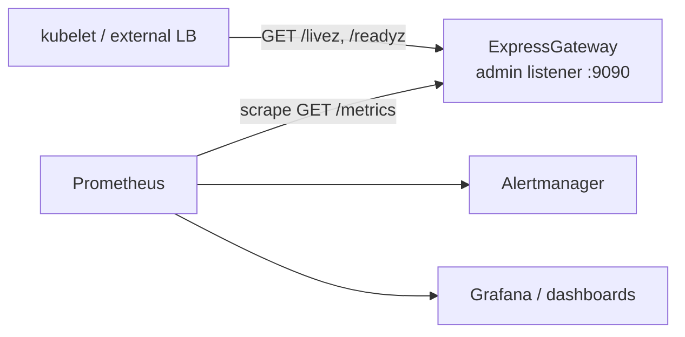

# Observability

How to actually monitor a running ExpressGateway: which signals to watch,
what healthy looks like, and the smallest useful set of alerts to start
with. This is the on-ramp; the two reference docs it sits on are:

- [`METRICS.md`](METRICS.md) — the **metric catalog**: every family, its
  labels, the cardinality budget, and the authoritative wired-vs-pending
  status of each metric.
- [`RUNBOOK.md`](RUNBOOK.md) — the **full alert catalog and triage**: every
  alert that can fire, its PromQL, severity, and the first command to run.

This page does not restate either. It teaches you where to look first.



*Monitoring topology: Prometheus scrapes `/metrics`; orchestrators probe
`/livez` and `/readyz` on the same admin listener.*

## The admin listener

Everything below is served by one HTTP admin listener, enabled by binding
it in config:

```toml
[observability]
metrics_bind = "127.0.0.1:9090"
```

It serves five endpoints:

| Endpoint | Purpose |
|----------|---------|
| `GET /metrics` | Prometheus text exposition (`text/plain; version=0.0.4`). |
| `GET /livez` | Liveness — 200 while the runtime is alive. |
| `GET /readyz` | Readiness — flips to **503** during a drain (the [lameduck](../glossary.md) signal). |
| `GET /startupz` | 200 once boot completes. |
| `GET /healthz` | Back-compat alias for `/livez`. |

The probes are anonymous; `/metrics` is token-gated once you set an admin
token. The default bind is **loopback only** — to let an off-host scraper
or a kubelet reach it you must bind non-loopback *with* a token, which also
protects `/metrics`. That setup is in
[`deployment-patterns.md`](deployment-patterns.md) "Health probes for the
fronting layer".

## The golden signals

Watch these first. They answer "is it serving, is it serving *well*, and is
it about to stop." Each names the metric family; look it up in
[`METRICS.md`](METRICS.md) for labels and exact wired status (some
finer-grained families are still being wired — that page is the source of
truth, not this one).

| Signal | Metric | Read it as |
|--------|--------|-----------|
| **Throughput** | `http_requests_total` (rate) | Requests/sec; a sudden drop means clients can't reach you or aren't being accepted. |
| **Errors** | `http_requests_total{status_class="5xx"}` (ratio) | The fraction of responses the gateway/backends failed. The first thing to alert on. |
| **Latency** | `http_request_duration_seconds` (p99) | Tail latency; pair with `backend_request_duration_seconds` to split gateway vs upstream. |
| **Saturation** | `connections_inflight` / `accept_inflight` vs the listener cap | How close a listener is to its admission ceiling. |
| **Drain health** | `shutdown_aborted_connections_total`, `shutdown_drain_seconds_*` | Whether deploys finish cleanly or truncate connections. |
| **Backend churn** | `pool_acquires_total` vs `pool_probe_failures_total` | Connection-pool reuse; high probe-failure ratio means upstream is half-closing idle conns. |
| **Crashes** | `panic_total` | A caught panic in the binary. Should be flat at zero. |

Bytes moved (`bytes_client_to_backend` / `bytes_backend_to_client`), DNS
cache behavior (`dns_cache_hits_total` / `dns_cache_misses_total`), config
reloads (`config_reload_*`), and cert rotations (`cert_rotation_*`) round
out the picture — see [`METRICS.md`](METRICS.md).

## What healthy looks like

A boring, healthy instance, steady-state:

- **`panic_total` is flat at 0.** Any increase is a real defect — page on it.
- **5xx ratio is low and stable** (well under ~1% for most workloads); a
  step change tracks a backend going bad.
- **p99 latency is stable**, and `backend_request_duration_seconds` is the
  dominant term (the gateway adds little) — a rising *gateway* p99 with flat
  backend latency points at saturation or pool churn, not the upstream.
- **`pool_probe_failures_total` is small relative to `pool_acquires_total`**
  — most cached connections are still good when reused.
- **`shutdown_aborted_connections_total` only moves during deploys**, and
  even then ideally stays 0 (the drain finished within budget). Movement
  *outside* a deploy means the process is restarting unexpectedly — correlate
  with `panic_total`.
- **DNS miss ratio is low** for IP-defined backends; hostname backends
  re-resolve on TTL, so a modest miss rate there is normal.

## A starter alert set

Begin with these four — they cover crashes, errors, latency, and unsafe
drains, and all four are emitted today. The PromQL is from
[`RUNBOOK.md`](RUNBOOK.md)'s alert catalog, which is canonical and holds the
full set (accept saturation, pool probe failures, cert rotation, XDP, DNS,
and more) plus the triage steps for each.

```yaml
groups:
  - name: expressgateway-starter
    rules:
      # Crash — page. (RUNBOOK: LbPanic)
      - alert: LbPanic
        expr: rate(panic_total[5m]) > 0
        labels: { severity: page }

      # Elevated 5xx — warn. (RUNBOOK: LbReq5xx)
      - alert: LbReq5xx
        expr: |
          sum by (listener) (rate(http_requests_total{status_class="5xx"}[5m]))
            / sum by (listener) (rate(http_requests_total[5m])) > 0.05
        for: 5m
        labels: { severity: warn }

      # Tail latency — warn. (RUNBOOK: LbReqDuration)
      - alert: LbReqDuration
        expr: |
          histogram_quantile(0.99,
            sum by (le, listener, version) (
              rate(http_request_duration_seconds_bucket[5m]))) > 1.0
        for: 10m
        labels: { severity: warn }

      # Drain truncated connections — warn. (RUNBOOK: LbShutdownAborted)
      - alert: LbShutdownAborted
        expr: increase(shutdown_aborted_connections_total[1h]) > 0
        labels: { severity: warn }
```

When one fires, go to [`RUNBOOK.md`](RUNBOOK.md) — each alert there has a
"Diagnose" section and the triage matrix maps the alert to its first
command.

## Scrape configuration

A minimal Prometheus job to get started:

```yaml
scrape_configs:
  - job_name: expressgateway
    scrape_interval: 15s
    static_configs:
      - targets: ['127.0.0.1:9090']
```

The **canonical** scrape config — including the metric-relabel rule that
keeps total series under the local Prometheus budget, and (for a
non-loopback admin bind) the `bearer_token` needed to read the token-gated
`/metrics` — lives in [`METRICS.md`](METRICS.md) "Scrape configuration".
Sample Grafana panels are there too.

## Logs

ExpressGateway emits **structured JSON logs by default** — one object per
event, suited to a log shipper (Loki, Elastic, CloudWatch). For
human-readable console output during development, set the format with an
environment variable before launch:

```bash
LB_LOG_FORMAT=text   target/release/expressgateway config.toml   # human-readable
# LB_LOG_FORMAT=json (the default) for structured output
```

`LB_LOG_FORMAT` accepts `json` (default) or `text` (alias `plain`). The log
*level* is controlled separately by `RUST_LOG` (e.g. `RUST_LOG=debug`),
independent of the format. Useful `journalctl` filters for a systemd
deployment are in [`RUNBOOK.md`](RUNBOOK.md) "Reading logs".

## See also

- [`METRICS.md`](METRICS.md) — metric catalog, cardinality budget, scrape
  config, Grafana panels (canonical).
- [`RUNBOOK.md`](RUNBOOK.md) — full alert catalog + triage (canonical).
- [`deployment-patterns.md`](deployment-patterns.md) — exposing the admin
  listener safely to a scraper or kubelet.
- [`troubleshooting.md`](troubleshooting.md) — when a signal looks wrong.
- [`glossary.md`](../glossary.md) — lameduck and the rest of the jargon.
