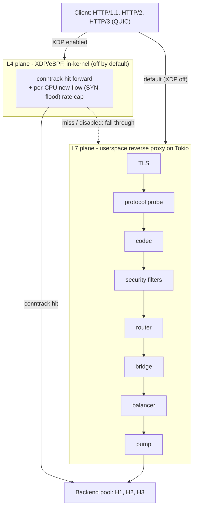

# What is ExpressGateway?

ExpressGateway is a memory-safe **L4 + L7 load balancer and reverse proxy**
written in Rust. It is built for teams that want first-class HTTP/3 and QUIC,
bounded-memory streaming across every HTTP version, and a security posture they
can audit — operated as a single binary and one TOML file. Reach for it when
those properties matter more than a mature plugin ecosystem or a dynamic xDS
control plane; if you need those, a mature incumbent is the better fit, and this
guide is candid about exactly where.

This page orients you: the shape of the system, how one request travels through
it, and how to decide whether it fits. The reference docs handle the details;
this page gives you the mental model to navigate them.

## The shape: two independent data planes

ExpressGateway is built from two planes that share a process but not a code
path. The **L7 plane** is a userspace HTTP proxy on Tokio — it terminates TLS,
decodes the request, runs the security filters, picks a backend, and streams
bodies through. The **L4 plane** is an optional in-kernel XDP/eBPF fast path that
forwards established flows without the packet ever reaching userspace. The two
are independent: you can run pure L7 (the default — XDP is off), pure L4, or
both.

*ExpressGateway's two data planes. The L7 pipeline is always available; the L4
XDP fast path is optional and off by default. Both forward to the same backend
pool.*

## How a request flows

A client connection lands on a listener. If the listener is TLS, **rustls**
completes the handshake and ALPN decides whether the client is speaking HTTP/1.1
or HTTP/2; a QUIC listener serves HTTP/3 directly. The matching **codec** —
hyper for H1/H2, quiche for H3 — decodes the request into a protocol-neutral
form. Before anything is forwarded, the **security filters** run: request-smuggling
checks, slowloris and slow-POST timeouts, and the flood/bomb detectors.

The **router** then matches the request to a backend cluster, the **bridge**
translates the neutral request into the backend's protocol (this is the 9-cell
matrix in action — an H2 client can reach an H1 backend, an H1 client an H3
backend, and so on), and the **balancer** picks a concrete backend. From there
the gateway **pumps** the request and response bodies frame-by-frame, never
holding a whole body in memory.

The L4 plane is different in kind. When XDP is enabled, the kernel program looks
each packet up in a connection-tracking table and, on a hit, rewrites and
forwards it in-kernel — those packets never reach the userspace pipeline at all.
A miss (or a kernel without XDP loaded) simply falls through to L7. The
stage-by-stage walk-through, with the concurrency and panic-free model, is in the
[architecture overview](../arch/overview.md).

## Use it when… / look elsewhere when…

**ExpressGateway is a strong fit when you want:**

- the full HTTP/1.1 ↔ HTTP/2 ↔ HTTP/3 matrix with hard memory bounds on every
  cell;
- QUIC you can **pass through without decrypting** (TLS end-to-end) or terminate
  and re-originate;
- a Rust data plane whose wire parsing is delegated to fuzzed libraries and whose
  libraries cannot panic;
- one binary, one config file, SIGHUP reload, and an explicit, auditable security
  posture.

**Look elsewhere — for now — when you need:**

- a dynamic / xDS control plane or built-in service-discovery integrations;
- a user-extensible filter / plugin / WASM ecosystem, or a WAF;
- server-side mTLS, response compression, or hot binary restart by
  socket-descriptor handover;
- a proven hyperscale production track record.

Most of those are deliberate, documented gaps rather than oversights — the
[comparison](comparison.md) page weighs each one against the incumbents.

## The marquee, briefly

| Capability | In one line |
|------------|-------------|
| **9-cell HTTP matrix** | Front {H1, H2, H3} × back {H1, H2, H3}, streamed, bounded memory. |
| **QUIC Mode A / Mode B** | Route by Connection ID without decrypting, or terminate and re-originate. |
| **DoS-mitigation catalog** | Rapid-Reset, CONTINUATION/SETTINGS/PING flood, HPACK/QPACK bomb, smuggling, 0-RTT replay. |
| **Panic-free libraries** | Crate-root deny lints + `panic = "abort"`, enforced in CI. |
| **Optional L4 XDP plane** | In-kernel TCP/UDP fast path, off by default, single-kernel. |

The complete, legend-coded view is in [capabilities.md](capabilities.md).

## A few constraints to weigh first

These are the ones most likely to affect an evaluation. Each links its canonical
home rather than restating it here:

- **Load balancing is round-robin in this build** (Maglev-by-Connection-ID for
  QUIC passthrough). Ten further algorithms exist in the library but are **not
  yet selectable from config** — [features.md](../features.md) "Load balancing".
- **It is stateless**: scale horizontally by running N instances behind an L4/L3
  load balancer; there is **no built-in clustering or failover** —
  [deployment-patterns.md](deployment-patterns.md).
- **Several capabilities are bounded or deferred**: health tracking is passive
  and not yet wired into selection (active probing deferred), gRPC needs an H2/H3
  front, WebSocket-over-H2 is gated off, the XDP plane is single-kernel and off
  by default, and there is no server-side mTLS or response compression. Each is
  explained in [known-limitations.md](../known-limitations.md).
- **The performance numbers come from one co-located 8-core box** — read the
  conditions before relying on any figure: [PERFORMANCE.md](PERFORMANCE.md).

Wire parsing is delegated to mature, fuzzed libraries (hyper, quiche/BoringSSL,
rustls, tungstenite), so the gateway's own hand-written parser surface is small;
the security model and the security-audit verdict are in [`SECURITY.md`](../../SECURITY.md).

## Where to next

Ready to run it? The [getting-started guide](getting-started.md) takes you from
zero to a served request — a container quickstart first, then a from-source
build and an HTTPS/HTTP-2 walkthrough. From there, [CONFIG.md](CONFIG.md) is the
knob-by-knob reference, and the pages linked above cover capabilities, the
comparison, performance, and the internals.
